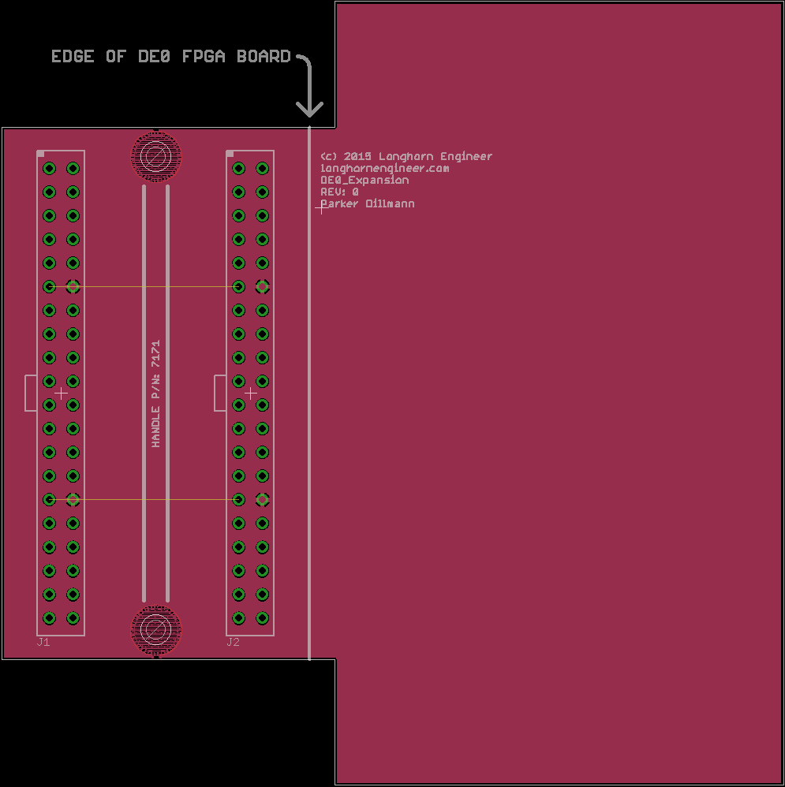

***
###DE0_Expansion
***
**Expansion template for the Altera DE0 Development Board.**

This template fits the 2 40Pin GPIO expansion headers for the [Altera DE0 Development Board by terasIC](http://www.terasic.com.tw/cgi-bin/page/archive.pl?Language=English&No=364). 

Files are for Eagle V6.0+ 

***

***

See [here for more information](http://longhornengineer.com/category/projects/hardware/de0-expansion-template/).

***
**License Information**

This project is under the [Creative Commons Attribution-ShareAlike 4.0 International License](LICENSE.md). These files are provided with no warranty and should be used at your own risk. 

***